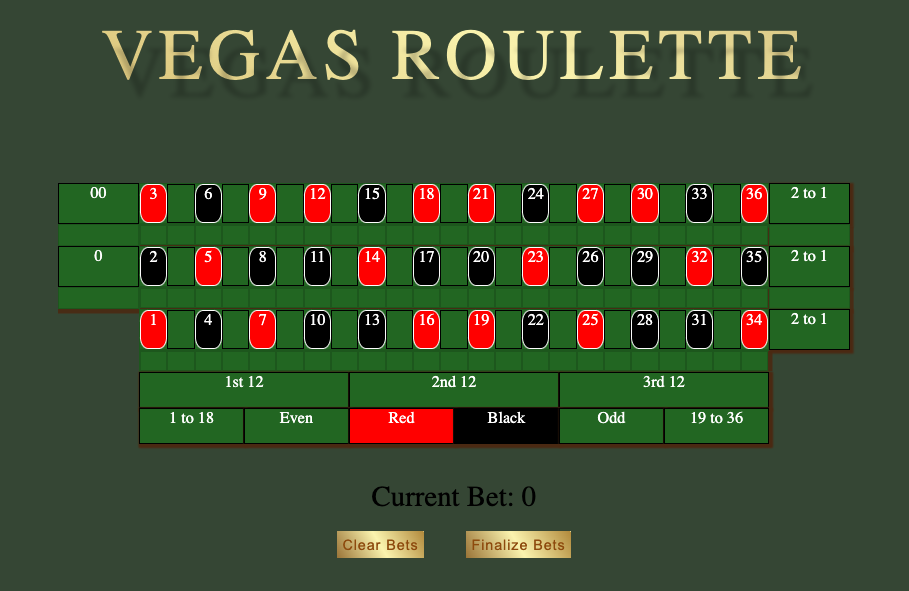
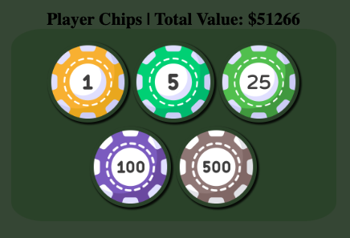

# Vegas-Roulette

#### A full-stack web application built as first project.

## Description
Vegas-Roulette is an iteration of the classic roulette game including 0 and 00 bets for house advantage. The player has $1000 starting cash and may play as many rounds until their wallet depletes. In roulette, you place your chips on the desired bet location. Dealer spins the wheel containing the numbers 0, 00, and 1-36. If the player placed a bet in a location including the outcome number, they win!

## Table of Contents
* [Technologies Used](#technologiesused)
* [Features](#features)
* [Design](#design)
* [Future Features](#nextsteps)
* [Deployed App](#deployment)
* [About the Author](#author)

## Technologies Used
* JavaScript
* HTML5
* CSS3

## Features

- Users can play rounds of Roulette
- Users can make bets on any location/bet type.

## Design
* Roulette table built from a 8 * 3 grid of divs. Flexbox utilized on the middle column to create the number and space bets.
* Gold gradient on game title and buttons. Buttons include click sound to enhance the player experience.
* Keyframe animations featured on landing page and roulette wheel image modal.
* Chips and buttons play animations when active. Furthermore, chips can be visually distinguised when selected.

## Future Features
* Allow the user to purchase chip color and custom chip amounts from the 'dealer'.
* Allow user to play along with other computers. Race to the most money with certain constraints (e.g., Most money after 10 rounds wins).
* Allow for chips to stack ontop of eachother with some indication of how many chips per type.
* Add a functioning roulette wheel with ball. Wheel spin result should reflect where ball landed visually.

## Deployed Link
Landing Page:
[Project-Roulette](https://casy1996.github.io/Project-Roulette/)

Main Game:
[Project-Roulette/main](https://casy1996.github.io/Project-Roulette/main/roulette.html)

* You can view the repository:
[Github.com](https://github.com/casy1996/Project-Roulette)
* If unable to view please go live locally through VS Code
  
    
## Works Cited:
- https://www.w3schools.com/howto/howto_css_modals.asp
- https://developer.mozilla.org/en-US/docs/Web/API/Element/classList
- https://www.troutfly.net/pinegrow-training/about-css/css-grid-justify-items.html

## About the Author:
Up and coming software developer with a passion for design and all things visual.